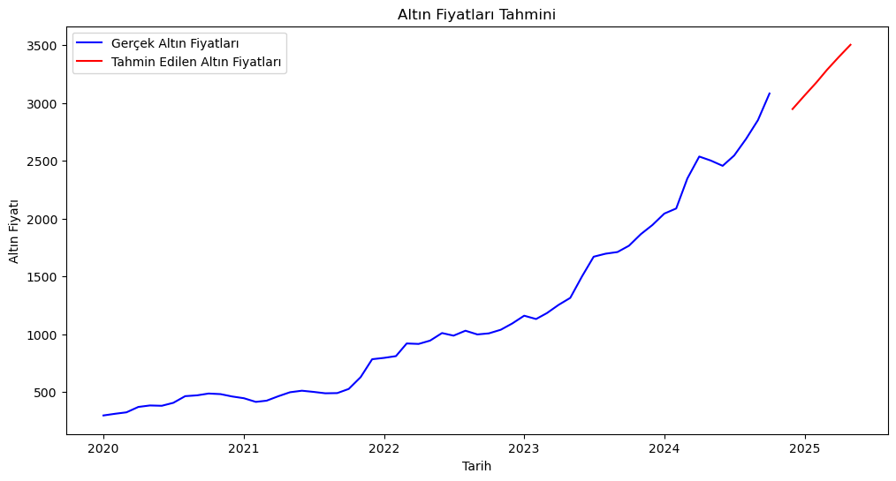

# Gold Price Prediction with LSTM

A deep learning project that predicts future gold prices using Long Short-Term Memory (LSTM) neural networks.

---

## 📊 Results

### Model Performance

| Metric | Value |
|--------|-------|
| Model | 2-Layer LSTM (150-150 neurons) |
| Final Training Loss (MSE) | 0.0022 |
| Time Step | 12 months |
| Forecast Period | 6 months |
| Training Epochs | 15 (Early Stopping) |

### 🔮 6-Month Price Forecast (TL)

| Month | Predicted Price |
|-------|-----------------|
| November 2024 | 2,946.88 TL |
| December 2024 | 3,063.03 TL |
| January 2025 | 3,176.24 TL |
| February 2025 | 3,286.90 TL |
| March 2025 | 3,398.92 TL |
| April 2025 | 3,502.94 TL |

---

## 🏗️ Project Structure

gold-price-prediction/
├── data/
│ └── goldprice.csv # Historical gold prices (2020-2024)
├── notebooks/
│ └── GoldPredict.ipynb # Jupyter notebook for analysis
├── src/
│ ├── model.py # LSTM model architecture
│ ├── preprocessing.py # Data loading & preprocessing
│ └── train.py # Main training script
├── results/
│ └── prediction.png # Prediction visualization
├── .gitignore
├── requirements.txt
└── README.md

---

## 📈 Dataset

| Info | Details |
|------|---------|
| **Source** | Manually collected |
| **Period** | January 2020 - October 2024 |
| **Records** | 58 monthly data points |
| **Feature** | Monthly average gold prices (TL) |
| **Start Price** | 297.01 TL |
| **End Price** | 3,081.60 TL |

---

## 🧠 Model Architecture
Input (12 months)
↓
┌─────────────────────────┐
│ LSTM Layer 1 │
│ 150 units │
│ return_sequences=True │
└─────────────────────────┘
↓
┌─────────────────────────┐
│ Dropout (30%) │
└─────────────────────────┘
↓
┌─────────────────────────┐
│ LSTM Layer 2 │
│ 150 units │
└─────────────────────────┘
↓
┌─────────────────────────┐
│ Dropout (30%) │
└─────────────────────────┘
↓
┌─────────────────────────┐
│ Dense Layer (1) │
│ Output: Next Price │
└─────────────────────────┘
